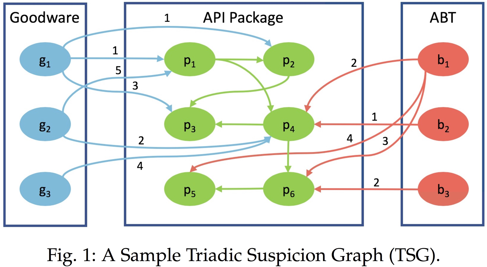

## DBank: Predictive Behavioral Analysis of Recent Android Banking Trojans (TDSC'19)

IEEE Transactions on Dependable and Secure Computing, 2019

Authors: [Chongyang Bai*](https://www.cs.dartmouth.edu/~cy/#four), [Qian Han*](https://qian-han.github.io/), [Ghita Mezzour](http://www.ghitamezzour.com/), [Fabio Pierazzi](https://fabio.pierazzi.com/), [V.S. Subrahmanian](http://home.cs.dartmouth.edu/~vs/) (* equal contribution, authors listed in alphabetic order)

[Link to the paper](https://ieeexplore.ieee.org/document/8684321)

### Introduction

**DBank** is a system to predict whether a given Android APK is a banking trojan or not using a novel dataset of Android banking trojans (ABTs), other Android malware, and goodware.

We introduce the novel concept of a **Triadic Suspicion Graph** (TSG for short) which contains three kinds of nodes: goodware, banking trojans, and API packages. We develop a novel feature space based on two classes of scores derived from TSGs: suspicion scores (SUS) and suspicion ranks (SR)—the latter yields a family of features that generalize PageRank. While TSG features (based on SUS/SR scores) provide very high predictive accuracy on their own in predicting recent ABTs.

Moreover, we have already reported two unlabeled APKs from VirusTotal (which DBank has detected as ABTs) to the Google Android Security Team—in one case, we discovered it before any of the 63 anti-virus products on VirusTotal did, and in the other case, we beat 62 of 63 anti-viruses on VirusTotal.

We also show that our novel TSG features have some interesting defensive properties as they are robust to knowledge of the training set by an adversary: even if the adversary uses 90% of our training set and uses the exact TSG features that we use, it is difficult for him to infer DBank’s predictions on APKs.

We additionally identify the features that best separate and characterize ABTs from goodware as well as from other Android malware. Finally, we develop a detailed data-driven analysis of five major recent ABT families: FakeToken, Svpeng, Asacub, BankBot, and Marcher, and identify the features that best separate them from goodware and other malware.

### Triadic Suspicion Graph (TSG) FEATURES

Given a set B of Android banking trojans (ABTs), a set G of goodware, and the set A of all available Android API packages, the Triadic Suspicion Graph associated with B, G. TSG is a graph with three types of vertices: members of G, members of A and members of B. A triadic suspicion graph TSG contains the following kinds of edges.



#### Suspicion Scores (SUS) and Suspicion Ranks (SR)

Suspicion scores (SUS) and suspicion ranks (SR), which are associated with API packages in the TSG. They will constitute the basis for our novel TSG-inspired feature space. Details can be found in the paper.

### Datasets

Links to datasets used in the paper:
- [Goodware vs. Android Banking Trojans API Package Features](./good_banker_API.csv)
- [Other-malware vs. Android Banking Trojans API Package Features](./other_banker_API.csv)

### Code setup and Requirements

Recent versions of numpy, sklearn, pandas, and [androguard](https://androguard.readthedocs.io/en/latest/intro/installation.html). You can install all the required packages using the following command:
```
    $ pip install -r requirements.txt
```

For security reason, we just release the extracted API Package features instead of the malware samples themselves. If you are cybersecurity researchers and want access to the samples, please send an email to qian.han.gr@dartmouth.edu explaining who you are and why you would like access.


### Running the DBank code

#### Extract [API Package](https://developer.android.com/reference/packages) Features
If you get Android APK samples, you can use API_Package_Feature_Extraction/GetFeatures.py to extract standard API package features. Before running the script, you need to do two modifications in GetFeatures.py.
1) modify SAMPLE_DIR to your own sample's directory. 
2) change SAMPLES_LIST to your own sample hash list.

Then running the script:
```
   $ python GetFeatures.py
```

#### Get Triadic Suspicion Graph (TSG) and do cross-validation

To train and test the DBank model using the `TSG_features_classification/good_banker_API.csv` or `TSG_features_classification/other_banker_API.csv` dataset, use the following command.

In `TSG_features_classification/config.py`, we also need to change API_feature_name to generate TSG features.

Especially, in *API_classifier.py*, 

Line 225 - 240: Preprocess for TSG features generation

Line 340 - 355: Calculate Suspicion scores (SUS) and suspicion ranks (SR) features and then append them to original features.

```
   $ sh execute_API_classifier.sh
```

It will generate corresponding classification results and *output_o.csv*, including API Package features, Suspicion scores (SUS) and suspicion ranks (SR), which are associated with API packages in the TSG used by cross-validation.

### Dataset format

The [API Package](https://developer.android.com/reference/packages) features should be in the following format:
- One line per sample.
- Each line should be android.provider, java.security.cert, ..., mw_name, label.
- First line is the API Package feature name.  
- All API package feature values are non-negative integers.
- In Android Level 23, there are 171 standard API packages in total. (3,459 standard API classes)
- *mw_name* is *sha256* for the sample.
- *label* should be 1 whenever the sample is an android banking trojan, 0 is a goodware or other-malware.


### References 
*DBANK : PREDICTIVE BEHAVIORAL ANALYSIS OF RECENT ANDROID BANKING TROJANS*. Chongyang Bai*, Qian Han*, Ghita Mezzour, Fabio Pierazzi, V.S. Subrahmanian (* equal contribution, authors listed in alphabetic order)

IEEE Transactions on Dependable and Secure Computing. TDSC'19.

If you make use of this code, or the datasets in your work, please cite our following paper:
```
@article{bai2019dbank,
  title={DBank: Predictive Behavioral Analysis of Recent Android Banking Trojans},
  author={Bai, Chongyang and Han, Qian and Mezzour, Ghita and Pierazzi, Fabio and Subrahmanian, VS},
  journal={IEEE Transactions on Dependable and Secure Computing},
  year={2019},
  publisher={IEEE}
}
```
